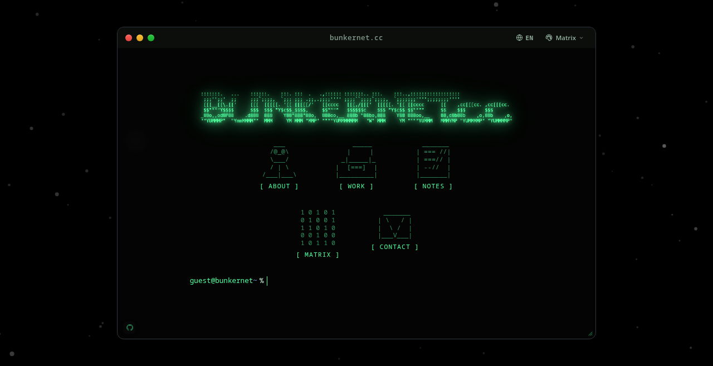

# bunkernet.cc

A terminal-style personal website and interactive dashboard built with vanilla JavaScript. No build step, no frameworks, zero dependencies.

[](LICENSE)
[](index.html)
[](index.html)
[](https://bunkernet.cc)

👉 **Live Demo:** [bunkernet.cc](https://bunkernet.cc)



```bash
# Clone and run locally
git clone https://github.com/0xM4lik/bunkernet.git
cd bunkernet
python3 -m http.server 8000
```
Open `http://localhost:8000` in your browser.

---

## Overview

bunkernet.cc is my personal portfolio and homelab landing page. It brings a desktop-style terminal experience to the browser, featuring draggable windows, synthesized sound effects, customizable themes, and an interactive canvas background — all running client-side using standard web technologies.

The project is built entirely with plain HTML, CSS, and modern JavaScript modules. There are no bundlers, no build pipelines, and no third-party runtime dependencies.

## Features

| Feature | Description |
|---|---|
| **Window Manager** | Draggable desktop windows. |
| **Interactive CLI** | Functional shell prompt with command history and autocompletion. |
| **Interactive Background** | Canvas-based 3D node network simulation with mouse reactivity and spring physics. |
| **Synthesized Audio** | Procedural UI sound effects using the Web Audio API without loading external audio files. |
| **Theme Engine** | 11 color palettes (Dark, Light, Matrix, Nord, Dracula, Gruvbox, Catppuccin, etc.) with automatic system light/dark detection. |
| **Internationalization (i18n)** | German (DE) and English (EN) localization with automatic browser/system language detection, persistent storage, titlebar toggle button, dynamic scramble animations, and CLI `lang` command. |
| **System Info & Globe** | Neofetch-style system summary with an interactive rotating ASCII globe in the About window. Inspired by https://github.com/adamsky/globe |
| **Modular Apps** | Extensible module format for easily adding new launcher buttons, windows and terminal commands. |

## Quick Start & Self-Hosting

Because the site is completely static, you can serve it with any HTTP server:

```bash
# Python
python3 -m http.server 8000

# Node.js
npx serve .

# Caddy
caddy file-server --listen :8000
```

### Self-Hosting with Docker

Build and run the lightweight Nginx container:

```bash
# Build the container
docker build -t bunkernet .

# Run on port 8080
docker run -d --name bunkernet -p 8080:80 bunkernet
```

Open `http://localhost:8080` in your browser.

For production static hosting, point **Cloudflare Pages**, **GitHub Pages**, **Vercel**, or **Netlify** at the repository root. No build command is required.

## Configuration

Site settings, links, and integration handles are located in [`js/config.js`](js/config.js):

```javascript
export const config = {
  siteName: 'bunkernet.cc',
  ownerName: 'Janik',
  promptUser: 'guest@bunkernet',
  promptPath: '~',

  // GitHub integration
  githubUsername: '0xM4lik',

  // Knowledgebase URL (Quartz, Hugo, Obsidian Publish, etc.)
  notesUrl: 'https://notes.bunkernet.cc',

  // Matrix chat
  matrixRoomUrl: 'https://matrix.to/#/!yIbWuYLKo8LuvvpO3yhkt5Xjvb1H5GeTbthNXggJRyc?via=matrix.bunkernet.cc',
  contactEmail: 'janik@bunkernet.cc'
};
```

## Adding Custom Modules

Adding a new launcher button, terminal command, and modal window takes a single file in `js/modules/`:

1. Create `js/modules/custom.js`:
```javascript
export default {
  id: 'custom',
  label: '[ CUSTOM ]',
  command: 'custom',
  windowTitle: 'Custom Module',
  asciiArt: `  _____  \n /     \\ \n|   *   |\n \\_____/ `,

  render() {
    return `<div class="tui-content"><p>Custom module content here.</p></div>`;
  }
};
```

2. Register the module in [`js/modules/index.js`](js/modules/index.js):
```javascript
import custom from './custom.js';

export const modules = [
  about,
  work,
  notes,
  matrix,
  contact,
  custom // <-- added
];
```

The system automatically adds the button to the terminal grid, wires up the CLI command (`guest@bunkernet ~ % custom`), and creates the draggable modal window.

## Terminal Commands

| Command | Description |
|---|---|
| `help` | List available commands |
| `about` | Display system summary and ASCII globe |
| `work` | Browse projects and GitHub repositories |
| `notes` | Open link to notes knowledgebase |
| `matrix` | Launch digital rain animation |
| `contact` | Show Matrix and email contact details |
| `theme <name>` | Switch theme (`matrix`, `nord`, `ocean`, `dark`, etc.) |
| `sound <on\|off>` | Toggle UI sound effects |
| `clear` | Clear prompt history |

## Technical Reference

For technical details on the canvas projection math, audio synthesis implementation, and module lifecycle, see [`documentation.md`](documentation.md).

## License

[MIT](LICENSE) © 2026 [Janik (0xM4lik)](https://github.com/0xM4lik)
