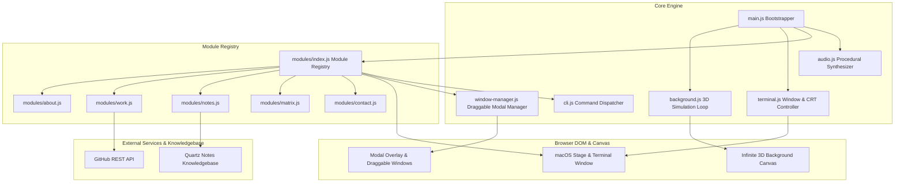

# Architecture & Technical Documentation

This document provides an exhaustive, deep-dive reference for the architecture, mathematical physics, procedural audio synthesis, dynamic module system, and terminal CLI engine powering **bunkernet.cc**.

---

## Table of Contents

1. [High-Level Architecture](#1-high-level-architecture)
2. [Infinite 3D Canvas Network Background](#2-infinite-3d-canvas-network-background)
   - [Toroidal Coordinate Wrapping](#toroidal-coordinate-wrapping)
   - [Seeded Deterministic PRNG & Clustering](#seeded-deterministic-prng--clustering)
   - [Projection & Rotation Pipeline](#projection--rotation-pipeline)
   - [Temporal Coherence Painter's Sort](#temporal-coherence-painters-sort)
   - [Spatial Uniform Grid Link Pruning](#spatial-uniform-grid-link-pruning)
   - [Intro Radial Reveal Wavefront & Pulse](#intro-radial-reveal-wavefront--pulse)
   - [Cursor Spring-Damper Physics](#cursor-spring-damper-physics)
3. [Procedural Web Audio Synthesizer](#3-procedural-web-audio-synthesizer)
   - [AudioContext Lifecycle & Autoplay Unlock](#audiocontext-lifecycle--autoplay-unlock)
   - [Tone Generation & Envelopes](#tone-generation--envelopes)
   - [Dual-Component Keyboard Switch Synthesis](#dual-component-keyboard-switch-synthesis)
   - [CRT Ignition Sequence & Static Discharge](#crt-ignition-sequence--static-discharge)
4. [Dynamic Module Registry & Window Manager](#4-dynamic-module-registry--window-manager)
   - [Module Interface & Lifecycle](#module-interface--lifecycle)
   - [Dynamic UI Generation & Scramble Animation](#dynamic-ui-generation--scramble-animation)
   - [Draggable Window Manager](#draggable-window-manager)
5. [Terminal Shell & CLI Engine](#5-terminal-shell--cli-engine)
   - [Command Dispatcher & Dynamic Resolution](#command-dispatcher--dynamic-resolution)
   - [History Buffer & Sanitization](#history-buffer--sanitization)
   - [Traffic Lights & Window State Machine](#traffic-lights--window-state-machine)
6. [External Integrations & Fallbacks](#6-external-integrations--fallbacks)
   - [GitHub REST API Integration](#github-rest-api-integration)
   - [Quartz Notes Integration](#quartz-notes-integration)
   - [Procedural Matrix Rain Simulation](#procedural-matrix-rain-simulation)
7. [Performance & Accessibility Best Practices](#7-performance--accessibility-best-practices)

---

## 1. High-Level Architecture

The application is structured as a client-side, zero-build, modular web application using native **ES6 Modules**.



---

## 2. Infinite 3D Canvas Network Background

The background is an infinitely-traversable 3D node field rendered onto a 2D canvas without external 3D libraries (e.g. Three.js). It implements an analytical pinhole perspective projection, spring-damper physics, and spatial grid acceleration.

### Toroidal Coordinate Wrapping

To achieve an infinite starfield while maintaining a deterministic, constant memory footprint ($N = 230$ nodes), all node positions live inside a repeating 3D box defined by dimensions $(W_x, W_y, W_z)$.

When the camera or a node moves across a periodic boundary, positions are wrapped using the modular helper:

$$\text{wrap}(v, S) = (v \bmod S + S) \bmod S$$

To calculate the relative distance between an observer $a$ and a target $b$ across the periodic boundary without duplicating objects in memory, the **shortest signed wrapped delta** is evaluated in $O(1)$:

$$\Delta(a, b, S) = (a - b) - \text{round}\left(\frac{a - b}{S}\right) \cdot S$$

This guarantees that every node is always projected from its nearest periodic copy relative to the camera.

### Seeded Deterministic PRNG & Clustering

Nodes are positioned deterministically using a **Mulberry32** pseudo-random number generator (seed `0xC0FFEE42`):

```javascript
function mulberry32(seed) {
  return function() {
    let t = seed += 0x6D2B79F5;
    t = Math.imul(t ^ t >>> 15, t | 1);
    t ^= t + Math.imul(t ^ t >>> 7, t | 61);
    return ((t ^ t >>> 14) >>> 0) / 4294967296;
  };
}
```

Instead of a uniform random scatter (which creates unnatural Poisson noise), nodes are placed around 11 cluster centers within the world volume. This generates organic network filaments and hubs.

### Projection & Rotation Pipeline

For each node $n = (x, y, z)$ relative to the camera $(\text{camX}, \text{camY}, \text{camZ})$:
1. Compute relative toroidal coordinates: $x' = \Delta(n.x, \text{camX}, W_x)$, $y' = \Delta(n.y, \text{camY}, W_y)$, $z' = \Delta(n.z, \text{camZ}, W_z)$.
2. Apply extrinsic Euler rotation matrix (Yaw $\psi \to$ Pitch $\theta \to$ Roll $\phi$):

$$\begin{bmatrix} x_1 \\ z_1 \end{bmatrix} = \begin{bmatrix} \cos\psi & -\sin\psi \\ \sin\psi & \cos\psi \end{bmatrix} \begin{bmatrix} x' \\ z' \end{bmatrix}$$

$$\begin{bmatrix} y_2 \\ z_2 \end{bmatrix} = \begin{bmatrix} \cos\theta & -\sin\theta \\ \sin\theta & \cos\theta \end{bmatrix} \begin{bmatrix} y' \\ z_1 \end{bmatrix}$$

$$\begin{bmatrix} x_3 \\ y_3 \end{bmatrix} = \begin{bmatrix} \cos\phi & -\sin\phi \\ \sin\phi & \cos\phi \end{bmatrix} \begin{bmatrix} x_1 \\ y_2 \end{bmatrix}$$

3. Perspective pinhole division:
   $$\text{depth} = D_{\text{camera}} - z_2$$
   $$\text{scale} = \frac{P}{\text{depth}} \quad (\text{where } P = \text{perspective constant})$$
   $$\text{screenX} = \frac{W_{\text{viewport}}}{2} + x_3 \cdot \text{scale}, \quad \text{screenY} = \frac{H_{\text{viewport}}}{2} + y_3 \cdot \text{scale}$$

### Temporal Coherence Painter's Sort

To render translucent glow rings and lines correctly, nodes must be drawn back-to-front. Because camera rotation between consecutive frames ($\Delta t \approx 16\text{ms}$) introduces only small perturbations, depth order exhibits extreme temporal coherence.

An in-place **insertion sort** operating on a persistent `Int32Array` index table executes in near $O(N)$ time per frame with zero heap allocations.

### Spatial Uniform Grid Link Pruning

Naively checking connection lines between all node pairs requires $\frac{N(N-1)}{2} = \frac{230 \times 229}{2} = 26,335$ distance calculations per frame.

To optimize this, a 3D uniform spatial grid with toroidal boundary wrapping partitions the world into cells of size $C \ge \text{maxReach}$. Each node is inserted into a linked-list hash table (`gridHead` and `gridNext` `Int32Array` buffers).

Each cell only tests candidate pairs against its own occupants and **13 forward neighboring cells** (avoiding double-checking pairs). This slashes pair evaluations down to $\sim 1,500$ checks per frame ($>94\%$ reduction).

```
   13 Forward Periodic Neighbor Directions:
   [-1,-1, 1], [ 0,-1, 1], [ 1,-1, 1]
   [-1, 0, 1], [ 0, 0, 1], [ 1, 0, 1]
   [-1, 1, 1], [ 0, 1, 1], [ 1, 1, 1]
   [-1, 1, 0], [ 0, 1, 0], [ 1, 1, 0]
   [ 1, 0, 0]
```

### Intro Radial Reveal Wavefront & Pulse

On page load, an expanding circular wavefront originates from the viewport center:

$$\text{radius}(t) = R_{\text{max}} \cdot \text{smoothstep}\left(0, 1, \frac{t - t_0}{T_{\text{reveal}}}\right)$$

As the expanding circle crosses a node, a Gaussian pulse function applies a momentary outward radial displacement and scale boost:

$$\text{pulseStrength} = \exp\left(-\left(\frac{\text{distCenter} - \text{radius}}{\sigma}\right)^2\right)$$

### Cursor Spring-Damper Physics

When hovering, nodes within cursor screen radius $R_{\text{cursor}}$ experience a 3D repulsion vector and a $Z$-axis twist. A spring-damper numerical integrator updates velocities:

$$a(t) = (p_{\text{target}} - p(t)) \cdot k_{\text{spring}}$$
$$v(t + \Delta t) = (v(t) + a(t)\Delta t) \cdot d^{\Delta t / 16.67}$$
$$p(t + \Delta t) = p(t) + v(t + \Delta t) \cdot 0.05 \Delta t$$

---

## 3. Procedural Web Audio Synthesizer

The sound system is 100% procedural—zero MP3/WAV assets are loaded over the network. All sounds are generated in real-time via the browser's **Web Audio API**.

### AudioContext Lifecycle & Autoplay Unlock

Browsers suspend `AudioContext` until the user interacts with the page. A global gesture listener captures the first touch/click/key event to immediately resume the context and trigger the startup tone if pending:

```javascript
const unlockEvents = ['pointerdown', 'mousedown', 'keydown', 'touchstart', 'click'];
function onFirstGesture() {
  initAudio();
  unlockEvents.forEach(e => window.removeEventListener(e, onFirstGesture, { capture: true }));
}
```

### Tone Generation & Envelopes

Every sound effect uses an `OscillatorNode` routed through a `GainNode` with exponential ramps:

```javascript
osc.frequency.setValueAtTime(freqStart, now);
osc.frequency.exponentialRampToValueAtTime(freqEnd, now + duration);
gain.gain.setValueAtTime(0.0001, now);
gain.gain.exponentialRampToValueAtTime(peakGain, now + attack);
gain.gain.exponentialRampToValueAtTime(0.0001, now + duration);
```

### Dual-Component Keyboard Switch Synthesis

When typing in the terminal prompt, `sound.keyTick()` synthesizes mechanical switch acoustics using two simultaneous oscillators:
1. **High Transient Click**: A high-frequency triangle wave sweeping from $1400\text{Hz} \to 280\text{Hz}$ over $26\text{ms}$.
2. **Low Resonance Thud**: A sine wave body thud sweeping from $240\text{Hz} \to 70\text{Hz}$ over $32\text{ms}$.

### CRT Ignition Sequence & Static Discharge

- **`terminalOpen()`**: An upward sub-bass sweep ($95\text{Hz} \to 780\text{Hz}$) simulating CRT power transformer coil charging, followed by a $1100\text{Hz} \to 240\text{Hz}$ snap $130\text{ms}$ later (relay closure).
- **`glitchStatic()`**: A sawtooth pulse ($180\text{Hz} \to 60\text{Hz}$) simulating electromagnetic deflection coil discharge during hardware jitter.

---

## 4. Dynamic Module Registry & Window Manager

### Module Interface & Lifecycle

Every launcher button and modal app window is defined as an `AppModule`:

```typescript
interface AppModule {
  id: string;                         // Unique ID (e.g. 'about', 'work')
  label: string;                      // ASCII label (e.g. '[ ABOUT ]')
  command: string;                    // CLI command alias (e.g. 'about')
  windowTitle: string;                // Modal titlebar text
  windowClass?: string;               // Optional custom CSS class (e.g. 'about-window')
  baseWidth?: number;                 // Base design width for 1.000 scale calibration
  baseHeight?: number;                // Base design height for 1.000 scale calibration
  asciiArt: string;                   // Multi-line ASCII artwork
  render(): HTMLElement | string;     // Generates window inner DOM/HTML
  onOpen?(winEl: HTMLElement): void;  // Called after window open animation
  onClose?(winEl: HTMLElement): void; // Called after window close animation
}
```

### Dynamic UI Generation & Full-Page Typewriter Stream Engine

The `ModuleRegistry` iterates registered modules:
1. Injects `.ascii-btn` buttons into `.menu-grid`.
2. Generates `.app-window` modals into `#appWindowsContainer`, stamping `data-base-w` and `data-base-h`.
3. Registers CLI command triggers in `cli.js`.

When a module window opens:
- `streamFullPageTUI(containerEl)` orchestrates a clean, blank-start sequential typewriter stream revealing headers, Neofetch ASCII art, spec rows, lines, and bracket-only buttons (`[ ACTION ]`) from top to bottom with procedural mechanical audio ticks (`sound.streamTick()`).
- Interactive buttons and links glow on hover (`text-shadow: 0 0 8px rgba(77, 255, 158, 0.85)`).
- An instant click-to-skip / keypress-to-skip listener enables fast reading without animation blocks.

### 2-Axis Aspect Ratio Window Scaling & Drag Engine

Modal windows feature translucent glassmorphism (`backdrop-filter: blur(16px)`), crisp 1px phosphor borders, fixed 38px titlebars with authentic traffic lights, and 100% monospace TUI typography calibrated to the main terminal:
- **Aspect Ratio Scale Calibration**: Window scale factors are evaluated against the window's natural design dimensions:

$$\text{scale} = \max\left(0.88, \min\left(1.80, \min\left(\frac{W_{\text{current}}}{W_{\text{base}}}, \frac{H_{\text{current}}}{H_{\text{base}}}\right)\right)\right)$$

At default dimensions, $\text{scale} = 1.000$, ensuring typography matches the main terminal (12px–13.5px). Widening a window gives horizontal breathing room without inflating font sizes.
- Pointer events are captured and tracked with continuous delta calculations for dragging and 8-directional resizing.
- Viewport boundary constraints ensure windows cannot be lost off-screen:

$$\text{left} = \min(W_{\text{viewport}} - 90, \max(-(W_{\text{window}} - 90), \text{left}))$$
$$\text{top} = \min(H_{\text{viewport}} - 40, \max(0, \text{top}))$$

- Clicking the backdrop overlay, close button, or pressing `Escape` closes the active modal window with an easing scale-down animation.

---

## 5. Terminal Shell & CLI Engine

### Command Dispatcher & Dynamic Resolution

When a command is submitted in the input prompt:
1. The input string is trimmed and converted to lowercase.
2. The command is checked against built-in commands (`help`, `clear`, `whoami`).
3. If not built-in, the command is resolved against `ModuleRegistry.getModuleByCommand(cmd)`. If found, `WindowManager.open(moduleId)` is called.
4. If unresolved, an error buzz tone is played with `command not found: <cmd>`.

### History Buffer & Sanitization

All executed commands and responses are appended to `#promptHistory`. HTML tags in user input are sanitized via `textContent` encoding to prevent XSS.

### Traffic Lights & Window State Machine

The terminal window supports macOS traffic light controls:
- **Close ($\times$)**: Collapses terminal scale and reveals the dock restore pill (`dockRestore`).
- **Minimize ($-$)**: Shrinks terminal toward the bottom-left dock.
- **Maximize ($+$)**: Toggles full-viewport expanded mode (`.maximized`).
- **Dock Restore Pill**: Re-ignites the terminal window with the opening animation and plays the CRT power tone.

---

## 6. External Integrations & Fallbacks

### GitHub REST API Integration (`modules/work.js`)

- Asynchronously queries `https://api.github.com/users/<username>/repos?sort=updated&per_page=6`.
- Extracts repository names, descriptions, primary language, and stargazers count.
- **Failover**: If GitHub rate limits or the request fails, falls back to a curated local cache of projects.

### Quartz Notes Integration (`modules/notes.js`)

- Provides a direct portal to the self-hosted Quartz knowledgebase configured at `config.notesUrl` (default: `https://notes.bunkernet.cc`).
- Seamlessly integrates with the terminal CLI command dispatcher (`guest@bunkernet ~ % notes`) and launcher button grid.

### Procedural Matrix Rain Simulation (`modules/matrix.js`)

- Dedicated 2D canvas stream rendering Japanese katakana, binary digits, and cyber glyphs.
- Renders fading trail persistence via semi-transparent rectangle fills (`rgba(5, 10, 8, 0.14)`).
- Starts rendering on window open; automatically pauses the `requestAnimationFrame` loop on window close to save CPU/GPU resources.

### Interactive 3D ASCII Globe Engine (`globe.js`, `modules/about.js`)

- Procedural spherical ray-casting with equirectangular UV mapping, inspired by `adamsky/globe`.
- Directional solar lighting calculates real-time day/night terminator boundaries, seamlessly blending between Day and Night ASCII textures.
- Features Earth's $23.4^\circ$ axial tilt, inertia/flick drag physics with exponential momentum decay ($v_{t+1} = v_t \cdot 0.92$), and smooth auto-spin resume.
- Synchronous HUD telemetry displaying live planetary rotation angle, axial tilt, and zoom factors.
- Sub-millisecond execution ($<0.04\text{ms}$ per frame in JS) with 0% background CPU consumption when the modal window is closed.

---

## 7. Performance & Accessibility Best Practices

1. **Zero-Allocation Hot Loop**: All math vectors, projection structures, and sorting buffers are pre-allocated typed arrays or reused objects.
2. **RGBA Lookup Table**: A 256-entry string table pre-computes `rgba(255,255,255,alpha)` values to prevent garbage collection pauses during canvas rendering.
3. **DPR Clamping**: `devicePixelRatio` is capped at $2.0$ to prevent fillrate exhaustion on $3\times+$ mobile displays.
4. **Tab Visibility Pausing**: Both the 3D background loop and Matrix rain loop hook into `visibilitychange` to pause rendering when the tab is inactive.
5. **Reduced Motion Compliance**: `prefers-reduced-motion: reduce` disables auto-orbit, reveal pulse waves, and cursor physics.
